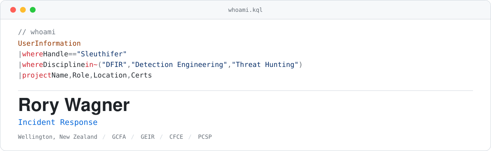

  <picture>
    <source media="(prefers-color-scheme: dark)" srcset="assets/header-dark.svg">
    <source media="(prefers-color-scheme: light)" srcset="assets/header-light.svg">
    
  </picture>

 

Incident response across Microsoft environments. Windows, Linux and M365 forensics, Entra ID investigation, and detection engineering in Sentinel and Defender. What I publish here is the material I use in casework.

 

<table>
<tr>
<td width="50%" valign="top">

### Detection and hunting

KQL for Microsoft Sentinel and Defender. Each query records the tables it needs and what it assumes about the environment.

[**KQL-Detections**](https://github.com/rorywag/KQL-Detections)

</td>
<td width="50%" valign="top">

### Areas of focus

- Hands-on IR across Microsoft estates, from triage through to root cause
- Detection engineering and tuning in Sentinel and MDE
- Threat hunting, and training analysts to do it

</td>
</tr>
</table>

 

GCFA, GEIR, CFCE, GIAC Advisory Board.

 

  <a href="https://www.linkedin.com/in/rorywagner">LinkedIn</a>
  &nbsp;&middot;&nbsp;
  <a href="https://rorywag.gitbook.io/sleuthifer">sleuthifer</a>

